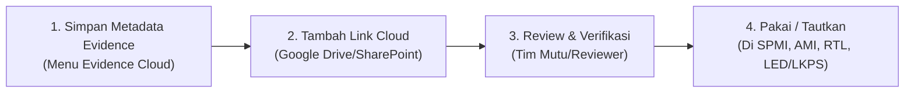
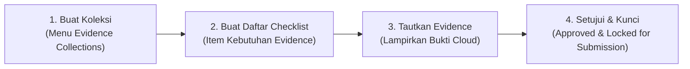

Penggunaan **Modul Evidence (Evidence Center)** di SQM dirancang dengan **2 jalur alur kerja (_workflow_)**, tergantung kebutuhan Anda:

---

### Alur 1: Jalur Utama / Standar (_Bottom-Up: Bank Evidence Cloud_)

Gunakan alur ini jika Anda ingin mendokumentasikan bukti-bukti kegiatan/kebijakan mutu terlebih dahulu agar siap dipakai di modul SPMI, AMI, RTL, maupun Akreditasi.

#### Langkah-langkahnya:

1. **Buat Metadata Evidence** _(Menu: Evidence Center $\rightarrow$ Evidence Cloud $\rightarrow$ Buat)_:
    - Isi kode evidence (misal: `SK-REKTOR-SPMI-2026`), judul, deskripsi, masa berlaku, dan scope (PT / Prodi).
2. **Tambahkan Tautan Cloud** _(Klik tombol `Tambah Link Versi` pada baris tabel)_:
    - Masukkan URL Google Drive/SharePoint/Dropbox dokumen Anda.
    - Isi nama dokumen, tipe file, dan hak akses link (_institution-managed_ / _restricted_).
3. **Pemeriksaan & Review Mutu**:
    - Klik **`Periksa Tautan`** untuk memastikan link bisa dibuka (tidak error 404 / izin akses terbuka).
    - Tim Reviewer/Penjamin Mutu mengklik **`Review Evidence Cloud`** dan mengubah status menjadi **Terverifikasi (`verified`)**.
4. **Pemanfaatan di Modul Lain**:
    - Bukti ini otomatis muncul di dropdown pilihan saat:
        - Mengisi bukti capaian target di **SPMI (Realisasi Indikator)**.
        - Melampirkan bukti tindak lanjut di **RTL (Tindakan Perbaikan)**.
        - Menjawab butir penilaian di **Akreditasi (LKE / LED / LKPS Workspace)**.

---

### Alur 2: Jalur Akreditasi / Audit Khusus (_Top-Down: Evidence Collections_)

Gunakan alur ini jika Anda sedang mempersiapkan **kumpulan berkas untuk event akreditasi atau audit tertentu**.

#### Langkah-langkahnya:

1. **Buat Koleksi Baru** _(Menu: Evidence Center $\rightarrow$ Evidence Collections $\rightarrow$ Buat)_:
    - Tentukan Nama Koleksi (contoh: _"Berkas Akreditasi LAM INFOKOM Prodi Informatika 2026"_).
    - Masukkan link folder induk Google Drive (_Root Folder URL_).
2. **Definisikan Checklist Kebutuhan**:
    - Buka tab/tabel _Item Kebutuhan Evidence_ di dalam koleksi tersebut.
    - Tambahkan butir persyaratan (contoh: _"SK Kurikulum OBE"_, _"Laporan Tracer Study 3 Tahun"_).
3. **Lampirkan Evidence yang Sesuai**:
    - Klik tombol **`Lampirkan Evidence yang Ada`** pada tiap butir checklist untuk menghubungkannya dengan data dari _Evidence Cloud_.
4. **Validasi & Finalisasi**:
    - Gunakan tombol **`Periksa Tautan`** untuk audit ketersediaan link.
    - Klik **`Setujui`** jika seluruh checklist sudah lengkap.
    - Klik **`Kunci untuk Pengajuan`** (_Lock for Submission_) saat berkas sudah final agar tidak dapat diubah-ubah lagi selama proses asesmen.

---

### 💡 Rekomendasi Praktis untuk Memulai Hari Ini:

1. Mulai dari **Menu Evidence Cloud**: Daftarkan 2–3 dokumen penting institusi/prodi Anda (seperti SK Struktur Organisasi, Kebijakan SPMI, atau Renstra) beserta link Google Drive-nya.
2. Coba fitur **`Tambah Link Versi`** $\rightarrow$ **`Periksa Tautan`** $\rightarrow$ **`Review Evidence Cloud`** (jadikan `verified`).
3. Bukti tersebut langsung siap dipakai di modul mana pun dalam SQM.
